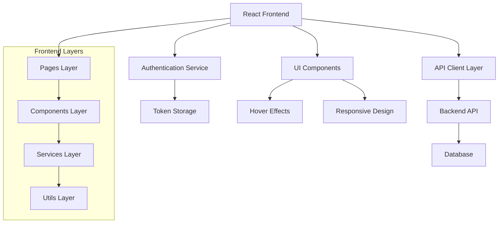
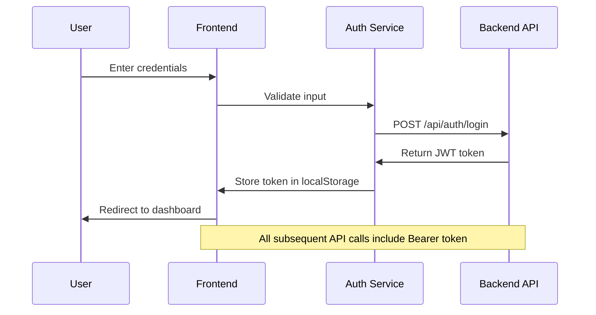

# Design Document

## Overview

This design outlines the comprehensive integration of the React news website with the live backend API, focusing on authentication, CORS resolution, UI/UX optimization, and ensuring all admin functionalities work seamlessly. The solution will maintain the existing component architecture while enhancing the user experience and backend connectivity.

## Architecture

### High-Level Architecture



### Authentication Flow



## Components and Interfaces

### 1. Authentication System

**Components:**
- `LoginForm`: Secure login interface with validation
- `AuthProvider`: Context provider for authentication state
- `ProtectedRoute`: Route wrapper for admin access control
- `AuthService`: Service for handling authentication logic

**Key Features:**
- JWT token management
- Automatic token refresh
- Session persistence
- Logout functionality

### 2. Enhanced API Client

**Improvements to existing `apiClient`:**
- Enhanced error handling for CORS issues
- Automatic retry mechanism for failed requests
- Request/response logging for debugging
- Token injection for authenticated requests

**New API Services:**
- `authApi`: Authentication endpoints
- `adminApi`: Admin-specific operations
- `breakingNewsApi`: Breaking news management
- `socialMediaApi`: Social media links management

### 3. UI/UX Enhancements

**Hover Effects System:**
```typescript
interface HoverEffect {
  type: 'scale' | 'glow' | 'lift' | 'color-shift';
  duration: number;
  intensity: number;
}
```

**Enhanced Components:**
- Category cards with smooth hover animations
- Interactive buttons with feedback
- Loading states for all async operations
- Toast notifications for user feedback

### 4. Admin Panel Optimization

**Dashboard Enhancements:**
- Real-time statistics from backend
- Quick action cards with hover effects
- Recent activity feed
- Performance metrics visualization

**Content Management:**
- Rich text editor for articles
- Image upload with preview
- Category management with drag-and-drop
- Bulk operations for articles

## Data Models

### Authentication Models

```typescript
interface LoginCredentials {
  email: string;
  password: string;
}

interface AuthResponse {
  success: boolean;
  token: string;
  user: AdminUser;
  expiresIn: number;
}

interface AdminUser {
  id: string;
  email: string;
  name: string;
  role: 'admin' | 'editor';
  permissions: string[];
}
```

### Enhanced API Response Models

```typescript
interface ApiResponse<T> {
  success: boolean;
  data: T;
  message?: string;
  pagination?: PaginationInfo;
  meta?: {
    timestamp: string;
    version: string;
  };
}

interface ErrorResponse {
  success: false;
  error: {
    code: string;
    message: string;
    details?: any;
  };
}
```

### UI State Models

```typescript
interface UIState {
  loading: boolean;
  error: string | null;
  notifications: Notification[];
  theme: 'light' | 'dark';
}

interface Notification {
  id: string;
  type: 'success' | 'error' | 'warning' | 'info';
  message: string;
  duration?: number;
}
```

## Error Handling

### CORS Error Resolution

1. **Frontend Configuration:**
   - Update API client to handle CORS preflight requests
   - Implement proper error messages for CORS failures
   - Add fallback mechanisms for network errors

2. **Backend Communication:**
   - Ensure proper headers are sent with all requests
   - Handle OPTIONS requests appropriately
   - Implement retry logic for failed CORS requests

### Error Boundaries

```typescript
interface ErrorBoundaryState {
  hasError: boolean;
  error: Error | null;
  errorInfo: ErrorInfo | null;
}
```

**Error Handling Strategy:**
- Global error boundary for unhandled errors
- API-specific error handling with user-friendly messages
- Network error detection and retry mechanisms
- Graceful degradation for offline scenarios

## Testing Strategy

### Unit Testing
- Authentication service functions
- API client methods
- UI component interactions
- Utility functions

### Integration Testing
- API endpoint connectivity
- Authentication flow end-to-end
- Admin panel functionality
- CORS configuration validation

### User Experience Testing
- Hover effects responsiveness
- Loading state transitions
- Error message clarity
- Mobile responsiveness

## Implementation Phases

### Phase 1: Backend Integration Foundation
- Configure API client for production backend
- Implement authentication system
- Resolve CORS issues
- Update favicon

### Phase 2: Admin Panel Enhancement
- Integrate all admin functionalities with backend
- Implement real-time data fetching
- Add comprehensive error handling
- Enhance UI components

### Phase 3: UI/UX Optimization
- Implement hover effects system
- Optimize loading states
- Enhance responsive design
- Add smooth transitions

### Phase 4: Testing and Polish
- Comprehensive testing of all features
- Performance optimization
- Accessibility improvements
- Final UI polish

## Security Considerations

### Authentication Security
- Secure token storage
- Token expiration handling
- CSRF protection
- Input validation and sanitization

### API Security
- Request rate limiting
- Proper error message handling (no sensitive data exposure)
- Secure headers configuration
- Input validation on all endpoints

## Performance Optimization

### Frontend Performance
- Code splitting for admin routes
- Lazy loading of components
- Image optimization
- Bundle size optimization

### API Performance
- Request caching where appropriate
- Debounced search functionality
- Pagination for large datasets
- Optimistic updates for better UX

## Accessibility

### WCAG Compliance
- Proper ARIA labels
- Keyboard navigation support
- Screen reader compatibility
- Color contrast compliance

### User Experience
- Clear focus indicators
- Consistent navigation patterns
- Error message accessibility
- Mobile-first responsive design